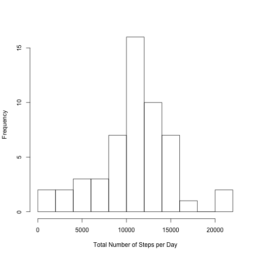
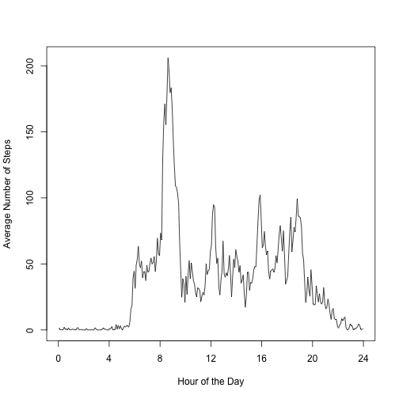
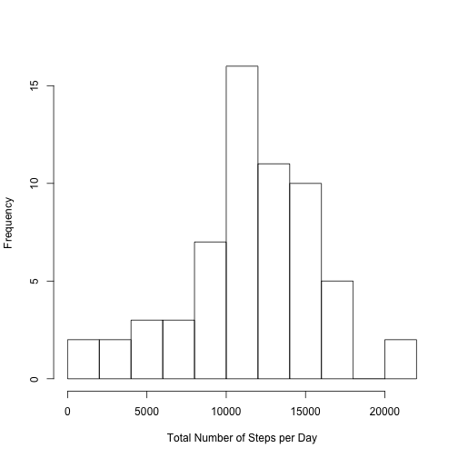
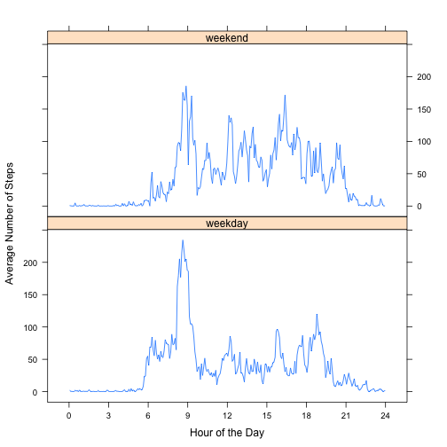

The data for this project consists in the number of steps taken by an anonymous individual 
during the months of October and November of 2012, binned in 5-minute intervals. The data 
is in **activity.zip** (zipped form of **activity.csv**) located in the [this forked version] 
of the [Peer Assessment Repository].

We begin by loading knitr and setting the global options so that all R source code is visible, 
results and messages are hidden and processing is cached: 

```r
# Load the knitr package (if not available, installs it)
if (!require(knitr)){
    install.packages("knitr");
    library(knitr);
};
# Set knitr global options
opts_chunk$set(echo=TRUE, message=FALSE, results="hide", cache=TRUE, 
               fig.path="figure/project1-", fig.align="center");
```


## Loading and preprocessing the data

Downloads the data from the forked repository (if not available in the current directory) 
and unzips it: 

```r
if (!file.exists("activity.zip") && !file.exists("activity.csv")){
    # Load the RCurl package (if not available, installs it)
    if (!require(RCurl)){
       install.packages("RCurl");
        library(RCurl);
    };
    # Get the activity.zip data from the repository
    bin<-getBinaryURL(url="https://github.com/ajrf/RepData_PeerAssessment1/raw/master/activity.zip", 
                      ssl.verifypeer=FALSE, followlocation=TRUE);
    # Write the data to activity.zip data file in the current directory
    con<-file("activity.zip", open="wb");
    writeBin(bin, con);
    close(con);
}
if (!file.exists("activity.csv"))
    unzip("activity.zip");
```


Load the data: 


```r
dataTable<-read.csv("activity.csv");
```

Data is ready for analysis (no preprocessing is necessary). 


## Analysis

Following the assignment instructions, the analysis will be divided into four parts: 

- What is mean total number of steps taken per day?
- What is the average daily activity pattern?
- Imputing missing values
- Are there differences in activity patterns between weekdays and weekends?

### What is mean total number of steps taken per day?

Calculates the total number of steps taken per day: 


```r
totalStepsPerDay<-tapply(dataTable$steps, dataTable$date, 
                         function(x) { 
                             ## In order to distinguish a day in which all values are NAs 
                             # from sum = 0, we set a day's sum of NAs to -1
                             if (sum(is.na(x))<length(x)){ 
                                 return(sum(x,na.rm=TRUE));
                             } else { 
                                 return(-1);
                             }
                         });
```


Makes a histogram of the total number of steps taken each day: 


```r
# Do the histogram without days of only NAs (identified as -1)
hist(totalStepsPerDay[totalStepsPerDay!=-1], breaks=10, main=NULL, xlab="Total Number of Steps per Day");
```




Calculates the mean and median of the total number of steps taken per day, discarding the 
missing values: 


```r
# Calculate the mean and median values without days of only NAs (identified as -1)
meanVal<-mean(totalStepsPerDay[totalStepsPerDay!=-1]);
medianVal<-median(totalStepsPerDay[totalStepsPerDay!=-1]);
meanVal
```

```
## [1] 10766.19
```

```r
medianVal
```

```
## [1] 10765
```

Reporting the mean and median: 

- the mean is **10766.19** (rounded to the second decimal 
point);
- the median is **10765**.


### What is the average daily activity pattern?

Generates the time series plot of the 5-minute interval casted as **Hour of the Day** (x-axis), 
since it is easier to read, versus the average number [across all days] of steps taken (y-axis), 
discarding missing values: 


```r
# Calculate average number of steps for each 5-minute interval, discarding missing values
avgStepsPerTimeSlot<-tapply(dataTable$steps, dataTable$interval, function(x) mean(x,na.rm=TRUE));
## Do the time series plot with Hour of the Day, instead of the simple 5-minute interval, in 
# the x-axis (e.g. to the interval 0-5 minutes is assigned the central value 2.5 minutes)
plot(c(0:287)*5/60+2.5/60, as.vector(avgStepsPerTimeSlot), xaxt="n", type="l", 
     main=NULL, xlab="Hour of the Day", ylab="Average Number of Steps");
axis(1, at=seq(0,24,by=4), labels=seq(0,24,by=4));
```




Determines which 5-minute interval contains the maximum number of steps (averaged across all 
days): 


```r
# Determine the 5-minute interval that contains the maximum number of (average) steps
maxAvgStepsTimeSlot<-which(avgStepsPerTimeSlot==max(avgStepsPerTimeSlot));
# Convert the 'maximum' 5-minute interval to Hour and Minute
hMax<-floor((maxAvgStepsTimeSlot-1)*5/60);
mMax<-((maxAvgStepsTimeSlot-1)*5)%%60;
maxAvgStepsTimeSlot
```

```
## 835 
## 104
```

```r
hMax
```

```
## 835 
##   8
```

```r
mMax
```

```
## 835 
##  35
```

The 5-minute interval with the highest number of average steps is the **104th** 
(or, equivalently, the interval **835** according to the notation used for 
the 'interval' column in the original dataset), which corresponds to the Hour of the Day interval: 
**8:35 to 8:40**. 


### Imputing missing values


```r
numNAs<-sum(is.na(dataTable$steps));
numNAs
```

```
## [1] 2304
```

The total number of missing values (NAs) is **2304**. 

Concerning the strategy for filling in the NAs, we chose to generate their values according 
to a normal distribution with mean and standard-deviation given by the mean and standard-deviation 
across all days (discarding NAs) of the corresponding 5-minute interval. We round to integer 
values and set negative values to 0.  

Creates the new dataset with the missing data filled in as described: 


```r
# Calculate the standard-deviation values of the original dataset, without missing values
stdStepsPerTimeSlot<-tapply(dataTable$steps, dataTable$interval, function(x) sd(x,na.rm=TRUE));

## Fill missing values (NAs) with normal distribution values with mean and standard-deviation 
# equal to the mean and standard-deviation of the original dataset (without missing values)
dataTableNAs<-dataTable[is.na(dataTable$steps),];
set.seed(101);
dataTableNAs$steps<-sapply(dataTableNAs$interval, 
                           function(x){ 
                               # the normal distribution for imputing NAs
                               tmp<-round(rnorm(1, 
                                                mean=avgStepsPerTimeSlot[which(x==names(avgStepsPerTimeSlot))], 
                                                sd=stdStepsPerTimeSlot[which(x==names(stdStepsPerTimeSlot))])); 
                               if (tmp < 0){
                                   return(0);
                               } else {
                                   return(tmp);
                               }
                           });
dataTableFilledNAs<-dataTable;
dataTableFilledNAs[is.na(dataTableFilledNAs$steps),]<-dataTableNAs;
rm(dataTableNAs);
```


Does a histogram of the total number of steps taken each day with the filled in missing 
values: 


```r
# Calculate total number of steps per day with the new dataset
totalStepsPerDayFilledNAs<-tapply(dataTableFilledNAs$steps,dataTableFilledNAs$date,sum);
# Do the histogram
hist(totalStepsPerDayFilledNAs, breaks=10, main=NULL, xlab="Total Number of Steps per Day");
```



Calculates the mean and median values: 


```r
# Calculate the mean and median values of the total steps per day in the new dataset 
meanValFilledNAs<-mean(totalStepsPerDayFilledNAs);
medianValFilledNAs<-median(totalStepsPerDayFilledNAs);
meanValFilledNAs
```

```
## [1] 11425.79
```

```r
medianValFilledNAs
```

```
## [1] 11458
```

The mean and median of the dataset with filled NAs is **11425.79** 
(rounded to the second decimal point) and **11458**, respectively. We see that 
imputing missing values according to the above strategy tends to shift the values upwards, a 
result that can be traced back to the fact that the standard deviation values are typically 
large. Indeed, as one decreases the standard deviation values assigned to the normal distribution, 
one becomes closer to the simple strategy of just assigning the mean values to NAs. With the 
simple strategy, the mean and median values of the dataset are very close to the ones of the 
original dataset. 


### Are there differences in activity patterns between weekdays and weekends?

Creates a new factor variable that identifies whether a given date is a weekday day (factor 
value "weekday") or a weekend day (factor value "weekend"): 


```r
# Get the day of the week values of the 'date' column
dateWeekdays<-weekdays(as.POSIXlt(dataTableFilledNAs$date));
# Categorise the day of the week values according to weekday or weekend
dateDayType<-sapply(dateWeekdays, 
                    function(x){ 
                        if (x %in% c("Sunday","Saturday")){ 
                            return("weekend"); 
                        } else { 
                            return("weekday"); 
                        }
                    });
rm(dateWeekdays);
# Convert the day-type (weekday or weekend) to a factor variable
dateDayType<-as.factor(dateDayType);
# Insert a column with the day-type in the dataset
dataTableFilledNAs$dayType<-dateDayType;
rm(dateDayType);
```


Calculates the average number (across all days of the same day-type [weekday day or 
weekend day]) of steps taken for each 5-minute interval: 


```r
# Calculate the average steps for each 5-minute interval, averaged across weekday days
avgStepsPerTimeSlotWeekday<-tapply(dataTableFilledNAs[dataTableFilledNAs$dayType=="weekday",]$steps,
                                   dataTableFilledNAs[dataTableFilledNAs$dayType=="weekday",]$interval,mean);
# Calculate the average steps for each 5-minute interval, averaged across weekend days
avgStepsPerTimeSlotWeekend<-tapply(dataTableFilledNAs[dataTableFilledNAs$dayType=="weekend",]$steps,
                                   dataTableFilledNAs[dataTableFilledNAs$dayType=="weekend",]$interval,mean);
# Merge the two in a single dataset 'avgStepsPerTimeByDayType'
avgStepsPerTimeByDayType<-as.data.frame(rbind(avgStepsPerTimeSlotWeekday,avgStepsPerTimeSlotWeekend));
rm(avgStepsPerTimeSlotWeekday, avgStepsPerTimeSlotWeekend);
# Insert a day-type column in 'avgStepsPerTimeByDayType'
avgStepsPerTimeByDayType$dayType<-c("weekday","weekend");
```


Makes a panel plot using the lattice plot system, showing the time series of the 5-minute 
interval, casted as Hour of Day (x-axis), versus the average number (across all weekday 
days or weekend days) of steps taken (y-axis): 


```r
# Load the reshape2 package (if not available, installs it)
if (!require(reshape2)){
    install.packages("reshape2");
    library(reshape2);
};
## Transform the 'avgStepsPerTimeByDayType' dataset so that 5-minute interval and average 
# number of steps become 'variable' and 'value' columns, respectively, with 'dayType' the 
# primary (id) column 
avgStepsPerTimeByDayType<-melt(avgStepsPerTimeByDayType, id="dayType", 
                               measure.vars=
                                   colnames(avgStepsPerTimeByDayType)[1:(ncol(avgStepsPerTimeByDayType)-1)]);

## Convert the the simple 5-minute interval 'variable' to Hour of the Day
# (e.g. to the interval 0-5 minutes is assigned the central value 2.5 minutes)
avgStepsPerTimeByDayType$variable<-rep(c(0:287)*5/60+2.5/60, each=2);
# Load the lattice package (if not available, installs it)
if (!require(lattice)){
    install.packages("lattice");
    library(lattice);
};
## Do the lattice plot with "weekend" and "weekday" panels, showing the time series of the 
# 5-minute interval, casted as Hour of Day (x-axis), versus the average number of steps
xyplot(value ~ variable | dayType, avgStepsPerTimeByDayType, layout=c(1,2), 
       type="l", ylab="Average Number of Steps", xlab="Hour of the Day", 
       xaxt="n", scales=list(x=list(at=seq(0,24, 3), 
                                    labels=seq(0,24, 3))));
```




[Peer Assessment Repository]: https://github.com/rdpeng/RepData_PeerAssessment1
[this forked version]: https://github.com/ajrf/RepData_PeerAssessment1
